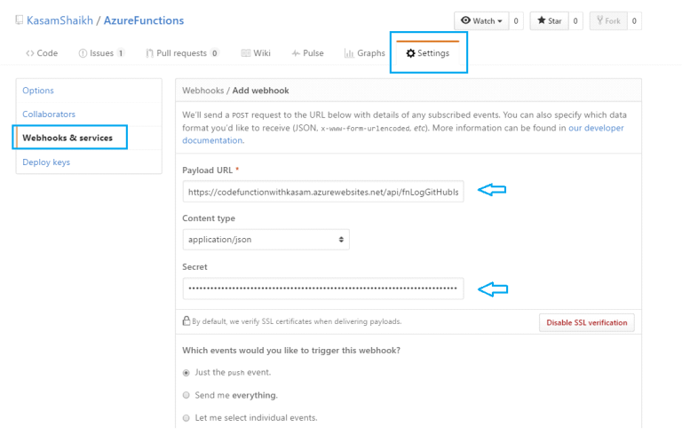
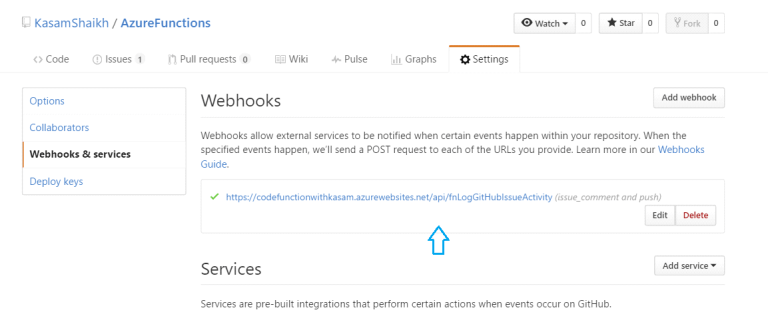

1. Click on **New => Web + Mobile => Function App** and Enter desired **Function App name**, and other details. Select the storage account (or create a new one) and click on **Create**.

After clicking on new function, you will be redirected to the below page with all different Azure Functions templates.

2. select **‘GitHub Webhook – Node’** template which will be triggered as per event over GitHub takes place. Give some appropriate name to this function and click **Create**. 

3. Assuming you have your **GitHub** account, go to GitHub and login. Navigate to **Settings => Webhook & Services** tab. Enter Payload URL with Function URL and and Secret key with **Function Key** from function's **Manage page** (not **Admin Key**).



Choose **Let me select individual events**,  select **Commit comment** as we need to trigger the functions when someone enters comment to any Commit in GitHub.
Once done click on Add Webhook.

Webhook will be added and it would look like the below screenshot (**green tick indicates the webhook is working with our function**)


**Testing**

4. Commit a change with comment on GitHub.
The same should get logged in our Azure function window, **Log** section.

**Log comments entered in GitHub to Azure DocumentDB using Azure Functions:**

6. go to Integrate section in Azure Functions window. Under Outputs, click on **New Output** => **Azure DocumentDB Document**. Check **Would you like the DocumentDB database and collection to be created for you?** and click on link **New**, you will be listed with existing DocumentDB account associated with your Azure account, if any. 
Once account selection is done, final window would appear. Click on Save, and navigate to Develop section in Window.

7. You can directly copy below code and paste it (be sure you code correct ‘Document Parameter Name’ present in Integrate window. Here as you can see, this name is output
Document and the same is added in code section).
```#node
context.bindings.outputDocument =
{text: "Comments: '"+ data.comment.body + "'"};
```


